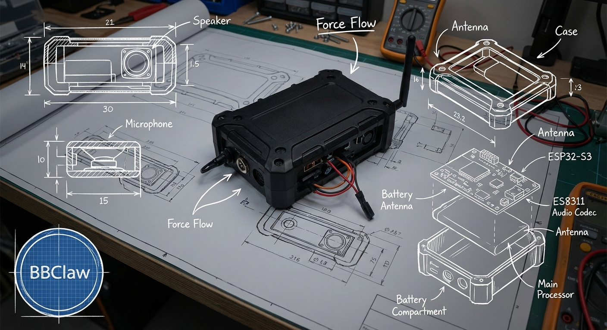

# BBClaw



BBClaw 是 OpenClaw 生态中的第一方硬件节点（Node），面向本地优先的低延迟语音与通知交互。

---

#### 🔌 Adapter 连接模式

> `adapter` / `cloud` 运行面不包含在本公开仓内。

| 模式 | 描述 | 状态 |
|------|------|------|
| **WiFi LAN** | 设备与 Adapter 连同一 WiFi，通过 IP 地址通信 | ✅ 已验证 |
| **BLE 蓝牙** | 通过 BLE 传输数据，免配网 | 🔄 开发中 |

**当前方案**: 设备烧录 WiFi 信息 + Adapter IP 地址，局域网内直连通信。

---

## 🚀 v0.1.0 发布 (2026-03-21)

### 首次开源发布！🎉

BBClaw 极客版 v0.1.0 现已开源，支持**叠加态**形态（同设备可切换 PTT / Pager 模式）。

#### ✅ 已实现功能

| 模块 | 功能 |
|------|------|
| **音频** | ASR 语音识别接入、VAD 语音活动检测 |
| **显示** | ST7789 显示屏驱动、LVGL 图形界面 |
| **交互** | PTT 按键控制、触觉反馈 (马达) |
| **连接** | WiFi 入网、Adapter / Gateway 配对 |
| **节点** | Adapter 音频入口、OpenClaw 文本/事件交互 |

#### 📡 架构图 (当前方案)

```
┌─────────────┐              ┌─────────────┐              ┌─────────────┐
│   BBClaw    │              │   Adapter   │              │   OpenClaw  │
│  (硬件设备)  │   WiFi LAN   │  (PC/手机)   │   HTTP/WS    │   Gateway   │
│              │◄────────────►│              │◄────────────►│   (服务端)  │
│  - ESP32-S3  │              │  - 固定IP    │              │             │
│  - ES8311    │              │  - 数据转发   │              │  - AI 处理   │
│  - ST7789    │              │  - ASR/TTS   │              │  - 节点文本入口 │
└─────────────┘              └─────────────┘              └─────────────┘
       │                            │                            │
       │  烧录配置:                  │                            │
       │  - WiFi SSID/密码           │                            │
       │  - Adapter IP 地址          │                            │
       ▼                            ▼                            ▼
   音频/控制                  流式音频/文本桥              Agent/LLM
```

#### 连接说明

| 链路 | 协议 | 说明 |
|------|------|------|
| BBClaw ↔ Adapter | WiFi LAN (同一内网) | 设备与 Adapter 在同一网络，通过 IP 通信 |
| Adapter ↔ Gateway | WebSocket | 以官方 node 方式注入 transcript / 订阅回复 |
| Gateway ↔ AI | OpenAI/本地模型 | 文本理解、回复生成 |

#### 🔌 Adapter 连接模式

| 模式 | 描述 | 状态 |
|------|------|------|
| **WiFi LAN** | 设备与 Adapter 连同一 WiFi，通过 IP 地址通信 | ✅ 已验证 |
| **BLE 蓝牙** | 通过 BLE 传输数据，免配网 | 🔄 开发中 |

**当前方案**: 设备烧录 WiFi 信息 + Adapter IP 地址，局域网内直连通信。

#### 📦 公开仓内容

- `firmware/` - ESP32-S3 全部固件源码，开源
- `docs/` - 架构、协议、硬件说明等文档，开源
- `scripts/` - 烧录/调试脚本，开源
- `tools/` - 本地 ASR/TTS 等可复用工具，开源

#### 🛠️ 硬件规格

- **MCU**: ESP32-S3
- **音频**: ES8311 CODEC
- **显示屏**: ST7789 240x240
- **形态**: 叠加态（支持 PTT / Pager 模式切换）

#### 📄 License

Apache License 2.0

---

## 📣 最新进度

### ✅ 已完成
- **音频 ASR 接入** - 成功接入 OpenClaw Gateway
- VAD 语音活动检测
- ST7789 显示屏驱动
- PTT 按键控制
- 触觉反馈 (马达)
- **WiFi LAN Adapter 模式**（已验证）

### 🔄 当前进行
- 叠加态模式优化（同一设备支持 PTT/Pager 切换）
- 适配器回路文本回显到设备

### ⏳ 下一步计划
1. 音频 ASR 接入大模型，提升准确度
2. 马达效果优化，提升反馈体验
3. LVGL 图形化页面设计
4. Adapter BLE 模式开发
5. 官网建设
6. 极客版本内部 100 台测试招募
7. 标品生产 - 寻求合作与投资量产

## 定位

- 不是第三方聊天平台 channel
- 是由 OpenClaw Gateway 直接管理的设备节点
- 当前开发主线是接入官方 `nodes` 体系，并向上游提交 PR

## 当前开发方向

本仓库不再继续维护独立插件型网关实现。

当前策略：
- 当前运行链路采用独立 `bbclaw-adapter` 负责流式音频与 ASR
- 与 OpenClaw 的边界优先保持在官方 `nodes` 文本/控制面
- 上游 PR 只考虑通用、最小、可解释的节点能力补充

当前已确认的方向：
- 设备对外主入口是 adapter，而不是让 Gateway 直接承载原始流媒体
- OpenClaw 继续作为官方 node 控制面与 transcript 入口
- 展示/下行目前先走 adapter 过渡桥，后续再评估通用上游能力

## 与 OpenClaw 的关系

- BBClaw 不是第三方聊天平台 channel
- BBClaw 作为硬件节点接入 OpenClaw 官方 `nodes` 体系
- 上游协作以通用、最小、可解释的能力补充为原则

## 形态

**叠加态设计**：BBClaw 设备支持 PTT 和 Pager 两种模式，通过软件切换：

1. Talkie-Talkie（PTT）- 对讲模式
- 设备按下 PTT 后采集音频并上传到 adapter
- adapter 完成 ASR，并把 transcript 文本送入 OpenClaw
- OpenClaw 生成回复；设备通过 adapter 侧桥接接收结果

2. Pager（BB机）- 通知模式
- 接收高优先级异步通知
- 支持离线补投与轻量摘要展示
- 设备侧触发震动/提示

## 项目结构

```text
bbclaw/
├── firmware/        # ESP32-S3 固件源码（C/C++），开源
├── docs/            # 架构、协议、硬件/使用文档，开源
├── scripts/         # 烧录、调试脚本
├── tools/           # 本地 ASR/TTS 等工具
├── CHANGELOG.md     # 版本历史
└── LICENSE          # Apache 2.0
```

## 常用命令

```bash
make -C firmware build
make -C firmware flash
make -C firmware monitor
```

## 相关文档

- 架构草案：[docs/architecture.md](docs/architecture.md)
- SaaS 平台架构草案：[docs/saas_platform_architecture.md](docs/saas_platform_architecture.md)
- 协议草案：[docs/protocol_specs.md](docs/protocol_specs.md)
- V1 协议基线：[docs/protocol_specs_v1.md](docs/protocol_specs_v1.md)
- OpenClaw 集成路线：[docs/openclaw_integration_plan.md](docs/openclaw_integration_plan.md)
- Beta 路线：[docs/beta_roadmap.md](docs/beta_roadmap.md)
