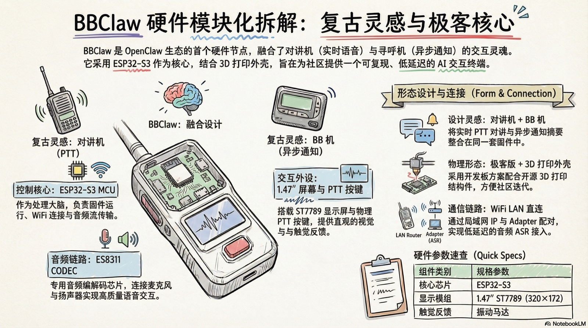
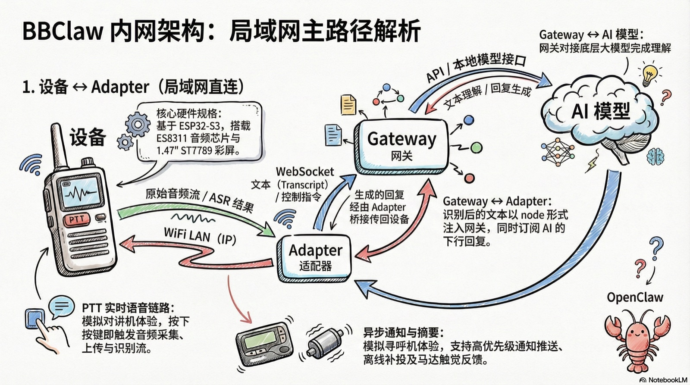

# BBClaw



BBClaw 是 OpenClaw 生态中的第一方硬件节点（Node），面向本地优先的低延迟语音与通知交互。

对讲机与 BB 机是**体验灵感**（实时语音 + 推送通知），由同一套固件统一承载，而非两种可切换的「模式」。

---

## 功能

| 模块 | 功能 |
|------|------|
| **音频** | ASR 语音识别接入、VAD 语音活动检测 |
| **显示** | 1.47″ ST7789（172×320，横屏 320×172）、LVGL |
| **交互** | PTT 按键控制、触觉反馈 (马达) |
| **连接** | WiFi 入网、Adapter / Gateway 配对 |
| **节点** | Adapter 音频入口、OpenClaw 文本/事件交互 |

## 硬件

- **MCU**：ESP32-S3
- **音频**：ES8311 CODEC（麦克风 / 扬声器链路）
- **显示**：1.47″ ST7789，横屏 320×172，LVGL
- **交互**：PTT 按键、振动马达

**v1.0 方向**：开发板极客方案 + 3D 打印外壳，优先可复现与体验迭代。

---

## 架构

### 局域网模式：IP 直连



设备与 Adapter 在同一 WiFi 内通过 IP 直连，延迟极低。

| 链路 | 协议 | 说明 |
|------|------|------|
| BBClaw ↔ Adapter | WiFi LAN | 同一内网，IP 直连 |
| Adapter ↔ Gateway | WebSocket | 官方 node 方式注入 transcript / 订阅回复 |
| Gateway ↔ AI | OpenAI / 本地模型 | 文本理解、回复生成 |

### 公网模式：CloudSaaS 桥接


通过 **CloudSaaS** 中转，BBClaw 在任意网络环境下都能连接家中的 HomeAdapter 和 OpenClaw 智能大脑，**随时随地连接你的"龙虾"助手**。

1. **云端注册** — 访问 bbclaw.cc 注册账户，输入设备验证码绑定硬件
2. **跨环境通信** — 户外设备音频上传至 CloudSaaS，穿透转发至家中 HomeAdapter
3. **接入 AI** — HomeAdapter 经 OpenClaw Gateway 接入智能大脑，回复原路回传

| | 局域网 | 公网 |
|---|---|---|
| **网络** | 同一 WiFi | 任意网络 |
| **链路** | BBClaw ↔ Adapter | BBClaw ↔ Cloud ↔ HomeAdapter |
| **延迟** | 极低 | 略高 |
| **距离** | 局域网内 | 无限制 |

> 详见 [公网 SaaS 架构文档](docs/cloud_saas_architecture.md)

---

## 快速开始

```bash
make -C firmware build
make -C firmware flash
make -C firmware monitor
```

## 项目结构

```text
bbclaw/
├── firmware/        # ESP32-S3 固件源码（C/C++）
├── docs/            # 架构、协议、硬件文档
├── scripts/         # 烧录、调试脚本
├── tools/           # 本地 ASR/TTS 工具
├── CHANGELOG.md     # 版本历史
└── LICENSE          # Apache 2.0
```

## 进度

### 当前进行

- 语音与通知链路的端侧体验持续优化
- 公网 CloudSaaS 拓扑工程化

### 下一步

1. 马达与 LVGL 界面打磨
2. BLE 等连接模式（规划中）
3. 极客套件文档：接线、BOM、3D 打印外壳说明

完整路线图见 [ROADMAP.md](ROADMAP.md)。

## 文档

- [架构](docs/architecture.md)
- [公网 SaaS 架构](docs/cloud_saas_architecture.md)
- [协议规范](docs/protocol_specs.md)
- [协议 V1 基线](docs/protocol_specs_v1.md)
- [OpenClaw 集成路线](docs/openclaw_integration_plan.md)

## License

Apache License 2.0
