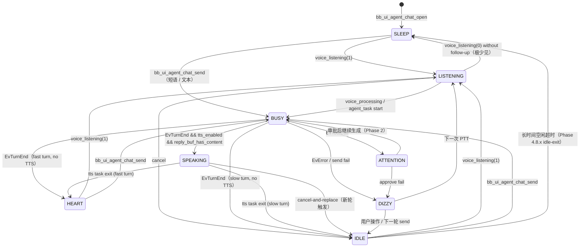

# Agent 九态状态机设计

> 状态：v0.4.0 已落地
> 日期：2026-04-27
> 相关文档：[STATE_MACHINE.md](STATE_MACHINE.md)（PTT/UI/LED 硬件态）、
> [agent_bus.md](agent_bus.md)、[firmware_agent_integration.md](firmware_agent_integration.md)、
> [ADR-009](decisions/ADR-009-agent-state-machine.md)

## 1. 背景

`STATE_MACHINE.md` 描述的是 **硬件/UI 层** 的状态机：PTT 按键的 IDLE/CAPTURING/WAITING、
App 锁状态、UI 显示态、LED 反馈态。这些都是"设备本身"的状态，与具体跑哪家 agent 无关。

本文档描述 **Agent 层** 的状态机：从 Agent Chat 屏幕被激活那一刻起，
"buddy 角色"在屏幕上呈现的 9 种语义态。它独立于硬件状态——
PTT 是按下还是松开属于硬件，buddy "在听" 还是 "在说" 属于 agent 层。

```
┌────────────────────────────────────────────┐
│  Agent 层（本文档）：9 态 buddy 角色机      │
│  SLEEP/IDLE/BUSY/ATTENTION/CELEBRATE/      │
│  DIZZY/HEART/LISTENING/SPEAKING            │
├────────────────────────────────────────────┤
│  UI 层（STATE_MACHINE.md §3）：UI_VIEW_*    │
├────────────────────────────────────────────┤
│  硬件层（STATE_MACHINE.md §1）：PTT 状态机  │
└────────────────────────────────────────────┘
```

两层通过事件桥接：硬件层的 PTT-down/PTT-up 触发 agent 层的 LISTENING 进入/退出，
agent 层的 BUSY/SPEAKING 不直接影响硬件层。

## 2. 9 个状态

| Enum | Buddy 表情 | Mood 文字 | 语义 | 谁触发 |
|---|---|---|---|---|
| `BB_AGENT_STATE_SLEEP` | `(-_-)` | `zzz...` | adapter 不可达 / 无活跃 session / 屏幕首次进入 | `bb_ui_agent_chat_open` 默认初始态 |
| `BB_AGENT_STATE_IDLE` | `(^_^)` | `ready` | 上一次 turn_end 之后，等待用户输入 | `EvTurnEnd`（不会播 TTS 时）/ TTS task exit / cancel |
| `BB_AGENT_STATE_BUSY` | `(o_o)` | `thinking...` | adapter 正在跑 driver / 流式生成中 | `agent_task` 启动；首个 SESSION/TEXT 帧 |
| `BB_AGENT_STATE_ATTENTION` | `(O_O)?` | `your turn` | 等待 tool_use 审批（Phase 2 才真正触发） | `EvToolCall` |
| `BB_AGENT_STATE_CELEBRATE` | `\(^o^)/` | `yay!` | token 累计达阈值（暂未接） | （预留，未接线） |
| `BB_AGENT_STATE_DIZZY` | `(X_X)` | `oops...` | 错误：HTTP / driver / 解析层 | `EvError` 或 `bb_agent_send_message` 返回非 ESP_OK |
| `BB_AGENT_STATE_HEART` | `(^_^)` | `<3` | 一轮 < 5s 完成（"快回复"小奖励） | `EvTurnEnd` 或 TTS exit，且 `now - turn_start_ms < BB_CHAT_HEART_THRESHOLD_MS` |
| `BB_AGENT_STATE_LISTENING` | `(o.o)"` | `listening...` | mic 录音中（PTT 按住） | `bb_ui_agent_chat_voice_listening(1)` |
| `BB_AGENT_STATE_SPEAKING` | `(^o^)~` | `speaking...` | TTS 合成 + 播放中 | `tts_playback_task` 入口 |

> Enum 顺序：前 7 个（SLEEP..HEART）是 Phase 4.6 buddy-ascii 主题原版；
> 后 2 个（LISTENING/SPEAKING）是 Phase 4.8.x 在 enum 末尾追加，**保留旧值**，
> 既不破坏现有 switch/dispatch 表，也避免重排带来的 NVS 兼容问题。

## 3. 状态转移图



## 4. 转移触发表

| From | To | 触发 | 代码路径 | 关键日志 |
|---|---|---|---|---|
| `*` | `SLEEP` | 屏幕初次激活 | `bb_ui_agent_chat.c:991` (`s_chat.state = BB_AGENT_STATE_SLEEP`) | `chat: open` |
| `IDLE/SLEEP/HEART` | `LISTENING` | PTT 按下 → `voice_listening(1)` | `bb_ui_agent_chat.c:1412` | `voice_listening(begin) → LISTENING` |
| `LISTENING` | `BUSY` | PTT 松开 → `voice_processing` | `bb_ui_agent_chat.c:1426` | `voice_processing → BUSY (ASR/cloud wait)` |
| `*` | `BUSY` | `agent_task` 启动 | `bb_ui_agent_chat.c:469` | `agent_task: start sid=...` |
| `BUSY` | `BUSY` | 首个 SESSION 帧（幂等） | `bb_ui_agent_chat.c:379` | `evt session sid=... new=1 driver=...` |
| `BUSY` | `BUSY` | 首个 TEXT 帧（幂等） | `bb_ui_agent_chat.c:385` | `evt text len=...`（仅首帧 set state） |
| `BUSY` | `ATTENTION` | `EvToolCall` | `bb_ui_agent_chat.c:396` | `evt tool_call tool=... hint=...` |
| `BUSY` | `SPEAKING` | `EvTurnEnd` 且会播 TTS | `bb_ui_agent_chat.c:889`（TTS task entry，由 TURN_END 经 `tts_kick_or_spawn` 触发）| `tts: streaming task start → SPEAKING` |
| `BUSY` | `IDLE` | `EvTurnEnd` 且不播 TTS 且 elapsed ≥ 5s | `bb_ui_agent_chat.c:424` | `evt turn_end (slow) → IDLE` |
| `BUSY` | `HEART` | `EvTurnEnd` 且不播 TTS 且 elapsed < 5s | `bb_ui_agent_chat.c:422` | `evt turn_end (fast) → HEART` |
| `BUSY` | `DIZZY` | `EvError` 或 send 失败 | `bb_ui_agent_chat.c:431,482` | `agent send failed: ESP_ERR_...` |
| `SPEAKING` | `IDLE` | TTS task exit (slow) | `bb_ui_agent_chat.c:926` | `tts: streaming task done ... → IDLE/HEART` |
| `SPEAKING` | `HEART` | TTS task exit (fast) | `bb_ui_agent_chat.c:924` | `tts: streaming task done ... → IDLE/HEART` |
| `*` | `IDLE` | 用户 cancel | `bb_ui_agent_chat.c:1367` | `cancel: user cancelled in-flight turn` |
| `IDLE/HEART` | `SLEEP` | 闲置超时（Phase 4.8.x idle-exit） | `bb_radio_app.c` 闲置回主屏 | `agent_chat: idle-exit` |

> 阈值常量：`BB_CHAT_HEART_THRESHOLD_MS = 5000`（`bb_ui_agent_chat.c:32`）。

## 5. 关键时机日志样本

下面是一次 PTT 语音轮的真机日志（注释行 `→` 标出对应的状态切换）。

```
# 1. 设备进入 Agent Chat（短按 OK 唤起）
I (12340) ui_agent_chat: chat: open                              → SLEEP
I (12345) bb_theme_buddy_ascii: face=(-_-) mood=zzz...

# 2. 用户按住 PTT 开始说话
I (15820) bb_radio_app: ptt: down → voice_listening(begin)
I (15825) ui_agent_chat: voice_listening(begin) → LISTENING      → LISTENING
I (15830) bb_theme_buddy_ascii: face=(o.o)" mood=listening...

# 3. 用户松开 PTT，开始上传 + ASR
I (18910) bb_radio_app: ptt: up → voice_processing
I (18915) ui_agent_chat: voice_processing → BUSY (ASR/cloud wait) → BUSY
I (18920) bb_theme_buddy_ascii: face=(o_o) mood=thinking...
I (19450) bb_adapter_client: stream finish: text="今天上海天气怎么样"
I (19460) ui_agent_chat: bb_ui_agent_chat_send (asr): "今天上海天气怎么样"

# 4. agent_task 拉起，HTTP 连接 adapter
I (19470) ui_agent_chat: agent_task: start sid= driver=claude-code
I (19475) ui_agent_chat: post_state BUSY (early)                 → BUSY (idempotent)

# 5. 首个 SESSION 帧到达
I (19880) ui_agent_chat: evt session sid=4f3c... new=1 driver=claude-code
I (19885) ui_agent_chat: post_state BUSY (on session)            → BUSY (idempotent)

# 6. 流式 TEXT 帧（合并显示）
I (20210) ui_agent_chat: evt text len=12 ("今天上海" ...)
I (20410) ui_agent_chat: evt text len=18
... (多帧合并)

# 7. TURN_END，TTS 启动
I (22050) ui_agent_chat: evt turn_end → tts_kick_or_spawn
I (22055) ui_agent_chat: tts: streaming task start → SPEAKING    → SPEAKING
I (22060) bb_theme_buddy_ascii: face=(^o^)~ mood=speaking...

# 8. TTS 一句句播放
I (22850) ui_agent_chat: tts: synth+play sentence (len=42)
I (24320) ui_agent_chat: tts: synth+play sentence (len=38)

# 9. TTS 全部播完，出 SPEAKING
I (26410) ui_agent_chat: tts: streaming task done (cancel=0 turn=1) → IDLE/HEART
# elapsed = 26410 - 19475 = 6935 ms ≥ 5000 → IDLE
I (26415) ui_agent_chat: post_state IDLE                         → IDLE
I (26420) bb_theme_buddy_ascii: face=(^_^) mood=ready
```

如果用户问的是简单题（< 5s 完成），第 9 步会落到 `HEART` 而非 `IDLE`，
mood 显示 `<3`（带情感的小奖励）。

## 6. 未来扩展

以下两个状态在 enum 里已经预留，但**还没接线**——当对应业务能力上线后再接。

### ATTENTION — tool_use 真审批

当前只在 `EvToolCall` 帧到达时短暂闪一下 `ATTENTION`，但**没有真正阻塞**等用户决定。
真实接线需要：

1. adapter 侧 `Approve()` 接口完成（见 [agent_bus.md §9 Phase 2](agent_bus.md#9-落地路径)）
2. 固件加 `bb_ui_agent_chat_approve(tool_id, decision)` 公开接口
3. 主题层加 ATTENTION 状态下的"按 OK 同意 / BACK 拒绝"提示
4. 收到决定后回 `{cmd:"permission",...}` 帧，BUSY 复位

### CELEBRATE — token 累计奖励

`bb_agent_theme.h` 里写了"`celebrate` → token 累计达阈值"，但当前 TOKENS 帧是被丢弃的：

```c
case BB_AGENT_EVENT_TOKENS:
  /* 4.1 不做 tokens 角标——后续阶段在 text-only 主题里加。 */
  break;
```

接线建议：在 `s_chat` 里加 `tokens_out_acc`，每收一帧累加；累计跨过 50K（或可配置）
就 `post_state(BB_AGENT_STATE_CELEBRATE)` 一次，5s 后回 IDLE。属于"惊喜动效"层，不影响主流程。

---

附：buddy 表情字符串以及 face/mood 渲染逻辑见 [`bb_theme_buddy_ascii.c`](../firmware/src/bb_theme_buddy_ascii.c) 第 117–125 行。`text-only` 主题不渲染表情，但同样响应 9 个状态以更新顶部状态条文字。
