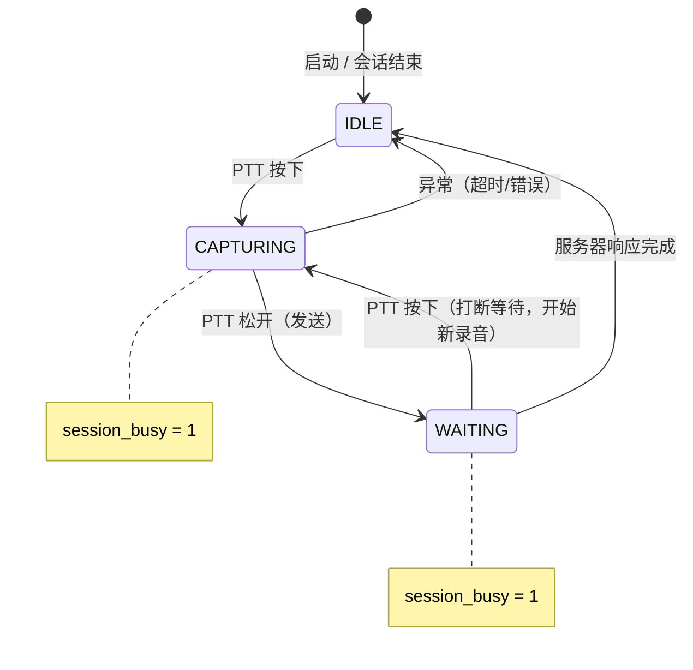

# 状态机设计文档

## 概述

BBClaw 固件采用多层次独立状态机架构，不同维度的状态分别管理，通过 `status` 字符串和回调函数进行联动。

```
┌─────────────────────────────────────────────────────────────┐
│  PTT 业务态  │  IDLE / CAPTURING / WAITING                │
│  (bb_radio_app.c)                                          │
├─────────────────────────────────────────────────────────────┤
│  App 锁状态  │  BBCLAW_STATE_LOCKED / UNLOCKED            │
│  (bb_radio_app.c)                                          │
├─────────────────────────────────────────────────────────────┤
│  UI 显示态  │  UI_VIEW_STANDBY / LOCKED / ACTIVE          │
│  (bb_lvgl_display.c)                                       │
├─────────────────────────────────────────────────────────────┤
│  WiFi 连接态 │  NONE / STA_CONNECTED / AP_PROVISIONING     │
│  (bb_wifi.c)                                               │
├─────────────────────────────────────────────────────────────┤
│  LED 反馈态  │  IDLE / RECORDING / PROCESSING / REPLY ... │
│  (bb_led.c)                                                │
└─────────────────────────────────────────────────────────────┘
```

---

## 1. PTT 按键状态机（核心）

PTT（Push-To-Talk）按键是 BBClaw 的核心输入设备。标准版和极客版行为一致。

### 1.1 状态定义

| 内部状态 | 说明 |
|----------|------|
| `IDLE` | 空闲态，`session_busy=0`，可接受新的 PTT 按下 |
| `CAPTURING` | 录音态，`session_busy=1`，用户按住 PTT，正在录音 |
| `WAITING` | 等待态，`session_busy=1`，PTT 已松开，等待服务器响应（此时按 PTT = 打断并开始新录音） |

> **关键变量**: `session_busy` 标志位贯穿整个录音-发送-等待周期，用于防止录音中误触发新的录音。

### 1.2 状态转换图



### 1.3 转换条件

| 当前状态 | 事件 | 行为 |
|---------|------|------|
| `IDLE` | PTT 按下 | 开始录音，进入 `CAPTURING` |
| `CAPTURING` | PTT 再次按下 | 错误震动，等待自然结束 |
| `CAPTURING` | PTT 松开 | 发送音频，进入 `WAITING`，`session_busy=1` |
| `WAITING` | PTT 按下 | **打断等待**，中止当前请求，进入 `CAPTURING`（重新开始） |
| `WAITING` | 服务器响应完成 | 进入 `IDLE`，`session_busy=0` |

### 1.4 标准版 vs 极客版

| 特性 | 标准版（有旋转编码器） | 极客版（单 PTT 按键） |
|------|----------------------|---------------------|
| 旋转编码器 | 有，旋钮可上下滚动 | 无 |
| 编码器中间按键长按 | 切换历史/滚动模式 | 不适用 |
| 录音中再按 PTT | 错误震动（`session_busy` 保护） | 错误震动（逻辑相同） |
| 等待中按 PTT | 打断并开始新录音 | 打断并开始新录音（逻辑相同） |
| 滚动功能 | 旋钮旋转控制 | 不支持 |

> 极客版无滚动功能。屏幕内容通过 TTS 播放和语音回复展示，无需手动滚动。

### 1.5 session_busy 标志

`session_busy` 是 PTT 状态机的核心保护标志：

```c
int session_busy = 0;  // 主循环局部变量

// 录音松手后设置
session_busy = 1;

// TX/RX 完整流程结束后重置
session_busy = 0;
```

**作用**: 防止录音过程中被再次按下打断。只有完成一次完整发送-响应周期后，才会重置为 0，允许下一次录音。

### 1.6 核心代码位置

| 功能 | 文件位置 |
|------|----------|
| PTT 主循环 | `firmware/src/bb_radio_app.c` |
| session_busy 设置 | `firmware/src/bb_radio_app.c` (voice_verify, voice.stream) |
| session_busy 重置 | `firmware/src/bb_radio_app.c` (多处) |
| bb_ptt 驱动 | `firmware/src/bb_ptt.c` |

---

## 2. App 锁状态

设备的核心业务锁状态，决定 PTT 的行为。

```c
typedef enum {
  BBCLAW_STATE_LOCKED = 0,   // 密语锁定态
  BBCLAW_STATE_UNLOCKED = 1, // 正常可使用态
} bb_radio_app_state_t;
```

| 状态 | 说明 | 触发条件 |
|------|------|----------|
| `BBCLAW_STATE_LOCKED` | Cloud SaaS 模式下设备锁定，按 PTT 触发密语验证 | 启动时自动设置（仅 cloud_saas 模式） |
| `BBCLAW_STATE_UNLOCKED` | 密语验证通过或 local_home 模式 | 密语验证 `match=true`；或 local_home 模式启动 |

---

## 3. UI 显示态

LVGL 屏幕的显示模式。

```c
typedef enum {
  UI_VIEW_STANDBY = 0,  // 时钟 + 品牌图标（待机）
  UI_VIEW_LOCKED,       // 锁图标 + 解锁提示
  UI_VIEW_ACTIVE,       // 状态栏 + 滚动文本区（对话）
} ui_view_mode_t;
```

### 3.1 状态说明

| 状态 | 屏幕内容 | 进入条件 |
|------|----------|----------|
| `UI_VIEW_STANDBY` | 时钟动画、品牌图标 | 无对话历史 + status 为 READY/null |
| `UI_VIEW_LOCKED` | 挂锁图标、解锁提示文案 | `radio_app_is_locked()` 为 true |
| `UI_VIEW_ACTIVE` | 顶部状态栏、中部滚动文本、录音波形 | 有对话历史 或 status 非空闲 |

### 3.2 状态栏模式指示器

在 `UI_VIEW_ACTIVE` 状态下，状态栏左侧显示当前运行模式：

| 指示器 | 图标 | 说明 |
|--------|------|------|
| HOME | 🏠 房屋图标 | local_home 模式（本地运行，无需网络） |
| CLOUD | ☁️ 云图标 | cloud_saas 模式（云端服务） |

**位置**: 状态栏最左侧，在状态图标（`s_img_status`）左边
**尺寸**: 20x20，与状态图标一致
**颜色**: 与状态图标使用相同的 `UI_STATUS_FG` 颜色

---

## 4. LVGL 自动滚动状态机

文本区域的自动滚动控制。

```c
typedef enum {
  UI_AUTO_SCROLL_HOLD_TOP = 0,   // 顶部停留
  UI_AUTO_SCROLL_RUNNING,       // 滚动中
  UI_AUTO_SCROLL_HOLD_BOTTOM,   // 底部停留
  UI_AUTO_SCROLL_IDLE,          // 滚动到底后停止，等待用户手动滚动或新内容
} ui_auto_scroll_phase_t;
```

**状态转换**:
```
HOLD_TOP → RUNNING → HOLD_BOTTOM → IDLE（停止）
```

| 状态 | 行为 |
|------|------|
| `HOLD_TOP` | 顶部停留 12 tick 后开始滚动 |
| `RUNNING` | 每 96ms 滚动 1px |
| `HOLD_BOTTOM` | 底部停留 14 tick；TTS 播放期间延长停留 |
| `IDLE` | 停在底部，不自动滚动，等待用户手动滚动或新内容到达后重置 |

