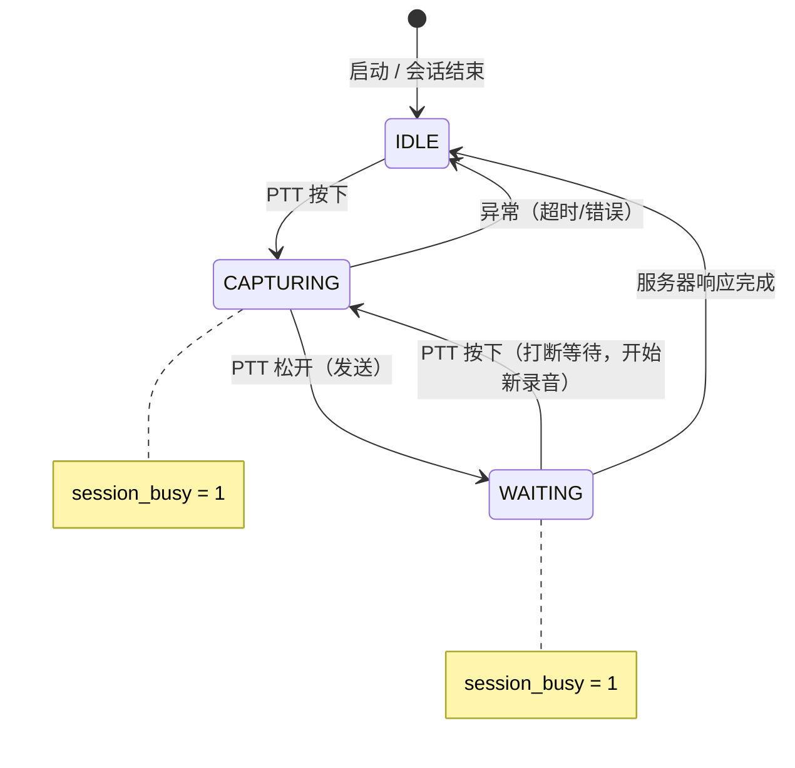

# 状态机设计文档

## 概述

BBClaw 固件采用多层次独立状态机架构，不同维度的状态分别管理，通过 `status` 字符串和回调函数进行联动。

```
┌─────────────────────────────────────────────────────────────┐
│  PTT 业务态  │  IDLE / CAPTURING / WAITING                │
│  (bb_radio_app.c)                                          │
├─────────────────────────────────────────────────────────────┤
│  App 锁状态  │  BBCLAW_STATE_LOCKED / UNLOCKED            │
│  (bb_radio_app.c)                                          │
├─────────────────────────────────────────────────────────────┤
│  UI 显示态  │  UI_VIEW_STANDBY / LOCKED / ACTIVE          │
│  (bb_lvgl_display.c)                                       │
├─────────────────────────────────────────────────────────────┤
│  WiFi 连接态 │  NONE / STA_CONNECTED / AP_PROVISIONING     │
│  (bb_wifi.c)                                               │
├─────────────────────────────────────────────────────────────┤
│  LED 反馈态  │  IDLE / RECORDING / PROCESSING / REPLY ... │
│  (bb_led.c)                                                │
└─────────────────────────────────────────────────────────────┘
```

---

## 1. PTT 按键状态机（核心）

PTT（Push-To-Talk）按键是 BBClaw 的核心输入设备。标准版和极客版行为一致。

### 1.1 状态定义

| 内部状态 | 说明 |
|----------|------|
| `IDLE` | 空闲态，`session_busy=0`，可接受新的 PTT 按下 |
| `CAPTURING` | 录音态，`session_busy=1`，用户按住 PTT，正在录音 |
| `WAITING` | 等待态，`session_busy=1`，PTT 已松开，等待服务器响应（此时按 PTT = 打断并开始新录音） |

> **关键变量**: `session_busy` 标志位贯穿整个录音-发送-等待周期，用于防止录音中误触发新的录音。

### 1.2 状态转换图


```mermaid
stateDiagram-v2
    [*] --> IDLE : 启动 / 会话结束
    IDLE --> CAPTURING : PTT 按下
    CAPTURING --> WAITING : PTT 松开（发送）
    WAITING --> CAPTURING : PTT 按下（打断等待，开始新录音）
    WAITING --> IDLE : 服务器响应完成
    CAPTURING --> IDLE : 异常（超时/错误）

    note right of CAPTURING : session_busy = 1
    note right of WAITING : session_busy = 1
```

### 1.3 转换条件

| 当前状态 | 事件 | 行为 |
|---------|------|------|
| `IDLE` | PTT 按下 | 开始录音，进入 `CAPTURING` |
| `CAPTURING` | PTT 再次按下 | 错误震动，等待自然结束 |
| `CAPTURING` | PTT 松开 | 发送音频，进入 `WAITING`，`session_busy=1` |
| `WAITING` | PTT 按下 | **打断等待**，中止当前请求，进入 `CAPTURING`（重新开始） |
| `WAITING` | 服务器响应完成 | 进入 `IDLE`，`session_busy=0` |

### 1.4 标准版 vs 极客版

| 特性 | 标准版（有旋转编码器） | 极客版（单 PTT 按键） |
|------|----------------------|---------------------|
| 旋转编码器 | 有，旋钮可上下滚动 | 无 |
| 编码器中间按键长按 | 切换历史/滚动模式 | 不适用 |
| 录音中再按 PTT | 错误震动（`session_busy` 保护） | 错误震动（逻辑相同） |
| 等待中按 PTT | 打断并开始新录音 | 打断并开始新录音（逻辑相同） |
| 滚动功能 | 旋钮旋转控制 | 不支持 |

> 极客版无滚动功能。屏幕内容通过 TTS 播放和语音回复展示，无需手动滚动。

### 1.5 session_busy 标志

`session_busy` 是 PTT 状态机的核心保护标志：

```c
int session_busy = 0;  // 主循环局部变量

// 录音松手后设置
session_busy = 1;

// TX/RX 完整流程结束后重置
session_busy = 0;
```

**作用**: 防止录音过程中被再次按下打断。只有完成一次完整发送-响应周期后，才会重置为 0，允许下一次录音。

### 1.6 核心代码位置

| 功能 | 文件位置 |
|------|----------|
| PTT 主循环 | `firmware/src/bb_radio_app.c` |
| session_busy 设置 | `firmware/src/bb_radio_app.c` (voice_verify, voice.stream) |
| session_busy 重置 | `firmware/src/bb_radio_app.c` (多处) |
| bb_ptt 驱动 | `firmware/src/bb_ptt.c` |

---

## 2. App 锁状态

设备的核心业务锁状态，决定 PTT 的行为。

```c
typedef enum {
  BBCLAW_STATE_LOCKED = 0,   // 密语锁定态
  BBCLAW_STATE_UNLOCKED = 1, // 正常可使用态
} bb_radio_app_state_t;
```

| 状态 | 说明 | 触发条件 |
|------|------|----------|
| `BBCLAW_STATE_LOCKED` | Cloud SaaS 模式下设备锁定，按 PTT 触发密语验证 | 启动时自动设置（仅 cloud_saas 模式） |
| `BBCLAW_STATE_UNLOCKED` | 密语验证通过或 local_home 模式 | 密语验证 `match=true`；或 local_home 模式启动 |

---

## 3. UI 显示态

2026-05-09 重构：三层独立页面模型，代码拆分到独立文件。

```c
typedef enum {
  UI_VIEW_STANDBY = 0,  // 大时钟（密语锁定时叠一行 dim "按住说密语解锁" 提示）
  UI_VIEW_LOCKED,       // 挂锁图标 + 密语反馈——仅密语**验证**那一下（VERIFY*）才显示
  UI_VIEW_ACTIVE,       // 顶栏 + 中间对话区 + 底栏（session/cwd）
} ui_view_mode_t;
```

### 3.1 文件组织

| 文件 | 职责 |
|------|------|
| `src/bb_page_standby.c` | STANDBY 独立视图：BBClaw + 时钟 |
| `src/bb_page_locked.c` | 密语**验证**反馈页：挂锁 + 「正在聆听密语 / 听到「…」」（仅 VERIFY* 时显示；空闲锁定走 STANDBY 时钟）|
| `src/bb_page_chat.c` | CHAT 主容器（Phase 3 骨架） |
| `src/bb_chat_topbar.c` | CHAT 顶栏（骨架） |
| `src/bb_chat_bottombar.c` | CHAT 底栏（骨架） |
| `src/bb_chat_transcript.c` | 对话气泡渲染（消息气泡、流式 append、历史） |
| ~~`src/bb_chat_recording.c`~~ | 录音波形遮罩 —— **已移除（2026-06）**，重绘过重拖慢 state→render；录音指示改由 ACTIVE 底栏 `BAR_LISTEN`(VU) 表达。文件暂留为死代码待清理 |
| `src/bb_chat_pickers.c` | session/cwd/driver picker 转发层 |
| `src/bb_lvgl_display.c` | LVGL 初始化 + 视图切换调度 |
| `src/bb_theme_buddy_anim.c` | Chat overlay（透明：仅 transcript。右上角 buddy 表情小窗已于 2026-06-10 移除，agent 状态改由顶栏图标 + 底栏 motif 表达） |

> 全机视觉语言（调色板 token、点阵 motif、各页面应用矩阵）见
> `design/UI_DESIGN_LANGUAGE.md`，代码侧落地为 `firmware/include/bb_ui_theme.h`。

### 3.2 状态转换

```
boot(cloud_saas+miyu) ──▶ STANDBY(时钟, 密语锁定: 显示"按住说密语解锁")

STANDBY(待机/时钟) ──PTT按下──┬─(已解锁)──────────────────────▶ CHAT(聊天)
                              └─(密语锁定)─▶ 密语验证(挂锁页 VERIFY*)
                                              ├─match=true ──────────▶ CHAT(自动恢复 session)
                                              └─no match ────────────▶ STANDBY(时钟)
CHAT ──idle 30s──▶ STANDBY
STANDBY ──idle 120s(cloud_saas)──▶ 静默重新上锁（视图仍是 STANDBY 时钟，只是下次 PTT 需密语）
```

> 2026-06 调整：锁定态不再独占一个「挂锁待机页」。密语设备**空闲时显示时钟**
> （像一块需要解锁的表盘，附 dim "按住说密语解锁" 提示），挂锁页 `UI_VIEW_LOCKED`
> 仅在**按住 PTT 做密语验证那一下**（`VERIFY*` 状态）出现，承载「正在聆听密语 /
> 听到「…」」反馈。安全门槛不变：PTT→密语验证的路由在 `bb_radio_app.c`，与视图无关。

### 3.3 CHAT 页面组成

Phase 7 架构：底层 ACTIVE 视图提供顶栏+底栏骨架，overlay 透明覆盖只填中间对话区。

- **顶栏**（底层 `bb_lvgl_display.c`）：mode icon + status icon + status text + WiFi + battery + clock
- **对话区**（overlay `bb_chat_transcript.c`）：消息气泡流
- **agent 状态表达**：~~右上角 buddy 表情小窗~~（2026-06-10 移除）+ ~~录音波形遮罩~~（2026-06 移除）均已退役——状态改由**顶栏 status 图标** + **底栏点阵 motif** 表达。底栏 chat 模式下由 agent 状态直接驱动（`bb_display_set_agent_bar_state`：IDLE→breathe / LISTENING→VU / BUSY→sweep / SPEAKING→wave / DIZZY→pulse）；VU 跟随真实麦克风电平
- **底栏**（底层 `bb_lvgl_display.c`）：session id + cwd name + 状态点阵 motif（见上）
- **录音时**：底层 `s_view_speaking` 在对话区位置显示波形动画
- **picker 时**：overlay 弹出 session/cwd 选择器覆盖对话区

### 3.4 空闲超时

| 超时 | 默认值 | 源→目标 |
|------|--------|----------|
| `BBCLAW_CHAT_IDLE_TIMEOUT_MS` | 30s | CHAT → STANDBY |
| `BBCLAW_STANDBY_LOCK_TIMEOUT_MS` | 120s | STANDBY → LOCKED（仅 cloud_saas） |

### 3.5 开机动画（Boot Splash）

诺基亚式像素点阵开机动画，与开机语音播报协同：

- **视觉**：复用待机页的点阵语言（dot 5px / pitch 9px / 5×7 字模），全屏深色底上先铺出 "BBCLAW" 六字母的 ghost 点阵，然后**逐列扫亮**（左→右，35ms/列，最新列青色高亮、下一拍沉淀为冷白），扫完后青色下划线从左向右生长收尾
- **层级**：挂在 `lv_layer_top()`，盖住启动落入的任何底层视图（LOCKED / STANDBY / ACTIVE）；结束后**同步硬切删除**（不做 opa fade——fade 会触发 LVGL 全屏 transient layer buffer，与 `esp_wifi_init` 的 10×1600B 内部 DMA 申请冲突 → NO_MEM boot loop）
- **语音协同**：开机语音（`BBCLAW_SPK_TEST_ON_BOOT` 的 boot wav）延迟到动画扫列完成后才播——`bb_radio_app_start` 在播放前等到动画开始后 ≥ `BBCLAW_BOOT_SPLASH_VOICE_DELAY_MS`（默认 1150ms ≈ 30 列扫完）；语音播完后若总展示不足 `BBCLAW_BOOT_SPLASH_MIN_MS`（默认 2600ms）补足
- **动画收尾保障**：扫列动画跑在 LVGL task 的 `lv_timer` 上，boot 期间音频 init/播放可能饿 LVGL task 导致节拍落后墙钟。dismiss 不只看 MIN_MS——补足后还要轮询 `bb_page_boot_anim_done()`（50ms 步长）直到动画真正收尾，上限多等 `BBCLAW_BOOT_SPLASH_ANIM_GRACE_MS`（默认 2000ms，防 LVGL 卡死时无限等），保证扫列+下划线完整播完才硬切
- **文件**：`src/bb_page_boot.c`；开关 `BBCLAW_BOOT_SPLASH_ENABLE`（默认 1）

```
display init ──▶ splash show ──▶ (硬件 init 继续) ──▶ 等到 ≥VOICE_DELAY ──▶ boot wav
                   │ 扫列动画在 LVGL task 独立跑                              │
                   └──── 等到 ≥MIN_MS 且 anim_done（grace ≤2s）◀─────────────┘
                                      └──▶ 同步硬切删除 → netconn 页接管（§3.5.1）
```

### 3.5.1 网络连接动画（Netconn Page）

待机页是点阵时钟，SNTP 同步前没有内容可显示（全 ghost ≈ 黑屏），而 WiFi 连接最长可达
30s+/SSID。开机动画硬切后由本页无缝接管，盖屏直到时钟有东西可看：

- **视觉**：同点阵语言（dot 5px / pitch 9px，同 palette）。屏幕中央偏上是**点阵 WiFi
  弧形图标**——底部 1 个基点 + 3 层同心弧（3/5/7 点），ghost 铺底后自下而上逐层点亮
  （~420ms/层，最新层青色闪、下一拍沉淀冷白），全亮后归 ghost 循环；图标下方一行
  `WiFi  <ssid>` 标签，每 ~500ms 轮询 `bb_wifi_get_active_ssid()`，重试切换 SSID 时
  自动跟随（这就是"目前正在尝试连接的 WiFi"）
- **相位**：连接中（弧循环）→ 连上（`bb_wifi_is_connected()`，弧全亮定格青色，标签换
  `SYNC TIME`）→ 时间就绪（`bb_wall_time_ready()`）自销毁，露出已有时间的待机时钟
- **自销毁兜底**：连上后超过 `BBCLAW_NETCONN_SYNC_TIMEOUT_MS`（默认 10s）时间仍未
  就绪也自销毁；待机时钟自身对 "--:--" 渲染居中横杠兜底，任何路径不再黑屏
- **显式退场**：provisioning 模式（让位 AP info 显示）和 wifi init 失败
  （让位错误显示）由 `bb_radio_app_start` 显式 dismiss
- **层级/内存**：挂 `lv_layer_top()`；show/dismiss 与 splash 同样**同步硬切、不做
  fade**（同 §3.5 的 NO_MEM 教训）；对象预算 ~20 dots + 1 标签，远小于 splash 的 210 dots
- **线程**：页内 lv_timer（LVGL task）轮询 app task 写的 wifi 状态/SSID，snprintf
  拷贝显示，弱一致可接受（与 AP info 显示同级别）
- **文件**：`src/bb_page_netconn.c`；开关 `BBCLAW_NETCONN_PAGE_ENABLE`（默认 1）

```
splash 硬切 ──▶ netconn show ──▶ esp_wifi_init/connect（页面自轮询 SSID）
   ├─ 连上 ──▶ SYNC TIME 相位 ──▶ time ready 或超时 10s ──▶ 自销毁 → 待机时钟
   ├─ provisioning ──▶ radio app 显式 dismiss → 配网页（§3.5.2）
   └─ 失败 ──▶ radio app 显式 dismiss → 错误显示
```

### 3.5.2 配网页（APConfig Page）

设备进入 SoftAP 配网模式时（首启无凭据 / 运行中 WiFi 掉线回落），过去把
AP 的 SSID/密码/IP 塞进一个**对话气泡**（`bb_display_show_chat_turn`）显示，
拥挤且与聊天内容混淆。现改为**独立全屏页**，与 netconn 同点阵语言：

- **视觉**：左侧是**点阵 WiFi 广播图标**（复用 netconn 的基点 + 3 层同心弧，
  自下而上向外涟漪扩散，~460ms/层，暗示"正在广播、等待加入"）；右侧是青色标题
  `WiFi 配网` + 三步加入指引，每行 `编号(青) + 描述(暗灰) + 值(冷白)`：

  ```
       ((•))      WiFi 配网
        弧          1  热点   BBClaw-<MAC>
                   2  密码   <password / 开放网络>
                   3  打开   <ap-ip>
  ```

- **数据**：show() 时一次性快照 `bb_wifi_get_ap_ssid/password/ip()`——配网会话期间
  固定不变；密码为空时值显示"开放网络"
- **生命周期**：本页只在用户提交凭据后由 `bb_wifi` 的 `esp_restart()` 收场，**无自销毁
  路径**；`show()` 在页已存在时是 no-op，故运行中掉线路径每个 loop tick 调用都安全
- **层级/内存**：挂 `lv_layer_top()`；show/dismiss 同步硬切不做 fade（同 §3.5 NO_MEM
  教训）；对象预算 ~16 dots + 7 标签
- **字体**：标题/描述用 `lv_font_bbclaw_cjk`（含 ASCII + 常用汉字），无 CJK 时回退
  英文（`WiFi SETUP` / `SSID` / `PWD` / `OPEN`）
- **文件**：`src/bb_page_apconfig.c`；预览 `sim --mode apconfig`

### 3.6 状态栏模式指示器

在 `UI_VIEW_ACTIVE` 状态下，状态栏左侧显示当前运行模式：

| 指示器 | 图标 | 说明 |
|--------|------|------|
| HOME | 🏠 房屋图标 | local_home 模式（本地运行，无需网络） |
| CLOUD | ☁️ 云图标 | cloud_saas 模式（云端服务） |

**位置**: 状态栏最左侧，在状态图标（`s_img_status`）左边
**尺寸**: 20x20，与状态图标一致
**颜色**: 与状态图标使用相同的 `UI_STATUS_FG` 颜色

---

## 4. LVGL 自动滚动状态机

文本区域的自动滚动控制。

```c
typedef enum {
  UI_AUTO_SCROLL_HOLD_TOP = 0,   // 顶部停留
  UI_AUTO_SCROLL_RUNNING,       // 滚动中
  UI_AUTO_SCROLL_HOLD_BOTTOM,   // 底部停留
  UI_AUTO_SCROLL_IDLE,          // 滚动到底后停止，等待用户手动滚动或新内容
} ui_auto_scroll_phase_t;
```

**状态转换**:
```
HOLD_TOP → RUNNING → HOLD_BOTTOM → IDLE（停止）
```

| 状态 | 行为 |
|------|------|
| `HOLD_TOP` | 顶部停留 12 tick 后开始滚动 |
| `RUNNING` | 每 96ms 滚动 1px |
| `HOLD_BOTTOM` | 底部停留 14 tick；TTS 播放期间延长停留 |
| `IDLE` | 停在底部，不自动滚动，等待用户手动滚动或新内容到达后重置 |

