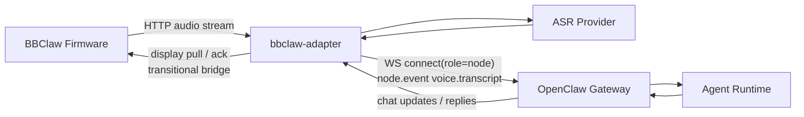

# BBClaw Architecture

## Positioning

BBClaw remains an OpenClaw-managed hardware integration, but the current runtime
no longer tries to stream audio directly through the OpenClaw Gateway.

Current production-oriented shape:

- BBClaw firmware streams audio to a repo-local `bbclaw-adapter`
- `bbclaw-adapter` terminates streaming/audio concerns and talks to ASR
- OpenClaw Gateway remains the text/control plane
- adapter forwards final transcript text into OpenClaw through the official node transport

公网版开始拆分后，运行面分成两条：

- `local_home`：`Firmware -> local bbclaw-adapter -> OpenClaw`
- `cloud_saas`：`Firmware -> BBClaw Cloud (audio + ASR) -> home-adapter -> OpenClaw`

This keeps the current implementation compatible with the official OpenClaw
`nodes` model where it is already strong, without forcing BBClaw-specific
streaming media semantics into upstream Gateway code.

## Components

- BBClaw device firmware: Wi-Fi client, PTT, microphone, speaker, display, vibration
- BBClaw adapter: HTTP stream ingestion, buffering, ASR/TTS integration, device display bridge
- ASR provider: local command, OpenAI-compatible HTTP service, or Doubao native ASR
- OpenClaw Gateway: official node handshake, pairing, session routing, agent ingress
- Agent runtime: assistant response generation and downstream actions

## Current Runtime Flow

1. Device uploads audio to `bbclaw-adapter` over LAN HTTP
2. Adapter buffers/transcodes the stream and calls ASR
3. Adapter connects to OpenClaw as `role: "node"`
4. Adapter emits `node.event` with `event: "voice.transcript"`
5. OpenClaw Gateway runs the agent on the transcript text
6. Adapter may subscribe to chat replies and bridge simplified display tasks back to firmware

Current downlink to firmware is still transitional:

- display tasks are queued by adapter-local `/v1/display/*` endpoints
- firmware polls adapter for display payloads
- this is a practical bridge for current firmware/adapter integration

## Local Vs Cloud

### Local Version

- `bbclaw-adapter` 负责音频流、ASR、TTS、展示桥
- 适合局域网内最低延迟运行
- `home-adapter` 不参与

### Cloud Version

- Cloud 负责公网音频入口、流聚合、ASR
- `home-adapter` 只负责 `voice.transcript -> OpenClaw -> voice.reply`
- `local-adapter` 与 `home-adapter` 是两个独立二进制，不再互相依赖

## Why Streaming Stops At The Adapter

This boundary is intentional.

- OpenClaw Gateway already handles text/control ingress for nodes well
- OpenClaw Gateway does not currently provide a clean upstreamable streaming audio path for BBClaw
- pushing BBClaw-specific binary media into official source would require larger, harder-to-merge changes
- isolating audio/ASR in adapter keeps the upstream PR surface smaller and more generic

## Upstream Route

The upstream route is still the official OpenClaw `nodes` route, but at the
text/control boundary instead of the raw streaming boundary.

The most plausible upstream changes are now:

- generic node text ingress semantics already aligned with `voice.transcript`
- generic node reply/update subscription semantics
- generic node display/control events when they are clearly reusable
- docs/tests that explain node-driven transcript ingress

The following are not current upstream priorities:

- BBClaw-specific binary media framing in Gateway
- a BBClaw-only streaming transport inside official source
- a second parallel device transport beside official nodes

## Data Flow Overview

## Local-First

- deployment remains LAN-first
- internet exposure is optional and user-managed
- firmware depends on adapter reachability, not direct Gateway media streaming
- OpenClaw remains the long-term control plane and integration anchor
