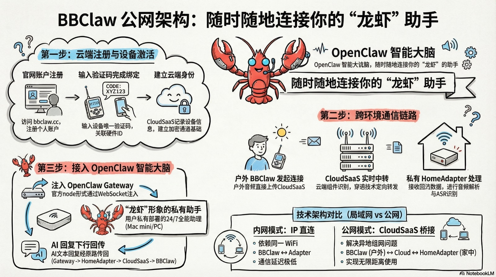
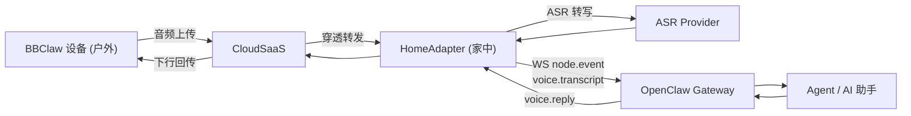

# BBClaw 公网 SaaS 架构

> 随时随地连接你的"龙虾"助手



## 概述

公网模式通过 CloudSaaS 中转层，让 BBClaw 设备在任意网络环境下都能连接家中的 HomeAdapter 和 OpenClaw 智能大脑，实现无限距离使用。

## 三步连接流程

### 第一步：云端注册与设备激活

1. 用户访问 **bbclaw.cc** 注册个人账户
2. 输入设备验证码（如 `XYZ123`），关联硬件 ID
3. CloudSaaS 记录设备信息，建立加密通道基础

### 第二步：跨环境通信链路

```
户外 BBClaw ──音频上传──► CloudSaaS ──穿透转发──► 家中 HomeAdapter
   (任意网络)            (云端组件识别/中转)        (音频解析 + ASR)
```

- **BBClaw 设备**：户外发起连接，音频直接上传至 CloudSaaS
- **CloudSaaS**：云端实时中转，通过穿透技术定向转发至用户私有 HomeAdapter
- **HomeAdapter**：接收回流数据，进行音频解析与 ASR 识别

### 第三步：接入 OpenClaw 智能大脑

- HomeAdapter 以官方 node 形式通过 WebSocket 注入 **OpenClaw Gateway**
- "龙虾"形象的私有助手运行在用户自有设备（Mac mini / PC）上，24/7 全能助理
- AI 文本回复经原路径回传：Gateway → HomeAdapter → CloudSaaS → BBClaw

## 技术架构对比

| | 内网模式：IP 直连 | 公网模式：CloudSaaS 桥接 |
|---|---|---|
| **网络要求** | 依赖同一 WiFi | 任意网络 |
| **链路** | BBClaw ↔ Adapter | BBClaw (户外) ↔ Cloud ↔ HomeAdapter (家中) |
| **延迟** | 极低 | 略高（经云端中转） |
| **距离** | 局域网内 | 无限制 |
| **适用场景** | 家中 / 办公室 | 户外、异地、跨网络 |

## 数据流



## 与局域网模式的关系

- 两种模式共享同一套固件，设备无需切换
- 局域网模式详见 [architecture.md](./architecture.md)
- CloudSaaS 仅作为中转桥接层，不替代 HomeAdapter 的音频处理与 ASR 能力
- OpenClaw Gateway 始终是控制面与智能入口
