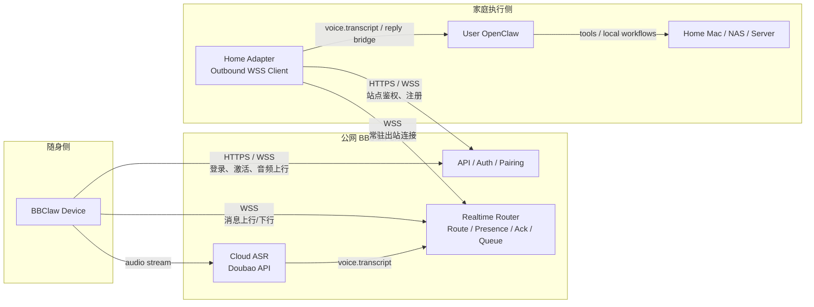
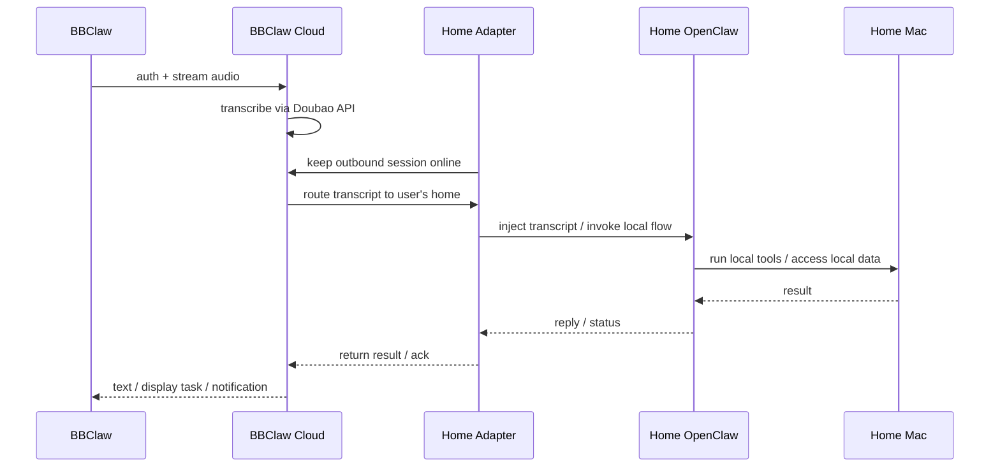

# BBClaw Cloud V1 架构图（首个可外带版本）

## 目标

这一版只解决一个核心问题：

- BBClaw 离开家庭局域网后，仍然可以访问用户自己的 `Home Adapter + OpenClaw + 家里电脑`

这一版的原则：

- 云端做 `control plane`，并终止公网侧音频上行与 ASR
- 用户私有执行面仍留在家里
- 不把云端做成另一个 OpenClaw node
- 不在第一版引入复杂实时双向音频编排

开发记录与当前实现状态请参考本仓已公开文档。

## V1 总体图

## 单次请求链路图

## V1 角色边界

### 1. BBClaw Device

负责：

- PTT、语音输入、状态显示、结果展示
- 连接公网 Cloud
- 不感知用户家里局域网地址

不负责：

- NAT 穿透中心逻辑
- 直接访问家庭 OpenClaw
- 多租户路由

### 2. BBClaw Cloud

负责：

- 设备激活与 pairing
- 当前简单模式下的 `device_id <-> home_site_id` 审批关系
- 公网音频接收与云端 ASR
- 实时路由
- 在线状态
- ack / retry / 离线消息缓存

不负责：

- 默认托管用户私有执行逻辑
- 默认运行用户本地工具链
- 直接接 OpenClaw 私有 node 语义做执行

### 3. Home Adapter

负责：

- 从家庭网络主动出站连接 Cloud
- 接收 Cloud 转发的 transcript / reply 请求
- 对接本地 OpenClaw
- 把结果回送 Cloud

### 4. User OpenClaw

负责：

- agent/runtime
- 本地工具调用
- 家庭电脑、本地文件、浏览器、自动化

## 为什么 V1 要这样切

- 当前仓库已稳定的边界是 `Firmware -> adapter -> OpenClaw`，不是设备直连 OpenClaw。
- 固件当前真实使用的是 adapter HTTP 协议，直接 node WS 仍是 stub。
- OpenClaw 官方 `nodes` 已适合承接 `voice.transcript` 和回复订阅，但不适合现在就承接 BBClaw 私有音频链路。

因此 V1 最稳的路线不是“让设备直接变成官方 node”，而是：

- 设备连 Cloud
- Home Adapter 连 Cloud
- Cloud 终止音频并做 ASR
- Home Adapter 只保留 transcript/reply 传话

## V1 最小能力清单

- `device activation`
- `device / home_site` 简单配对审批模型
- `device <-> cloud` 双向消息通道
- `home_adapter <-> cloud` 常驻出站通道
- `request / reply / ack / timeout` 路由
- `offline queue` 基础版
- `display task` 回传

## 当前简单配对模式

在当前阶段，还没有完整用户体系，因此配对流程先简化为：

1. 设备注册到 Cloud
2. 设备指定目标 `home_site_id`
3. Cloud 创建待审批配对
4. 后台审批通过后，设备才允许使用转发链路

也就是说，当前 pairing 的语义就是：

- 默认拒绝
- 后台批准
- 绑定 BBClaw 到某个 Home Adapter 站点

后续引入用户体系时，再把：

- device
- home adapter
- user
- tenant

统一并入正式账号绑定模型。

## V1 暂不做

- 云端直接托管完整 AI runtime
- 云端直接执行用户本地命令
- 复杂双向流式音频中继
- 改 OpenClaw 官方源码去承载 BBClaw 原始音频流

## 一句话定义

BBClaw Cloud V1 不是执行用户 AI 的地方。

它是让用户在外面时，仍能安全访问“自己家里的 Home Adapter、自己的 OpenClaw、自己的电脑”的公网传话层。
