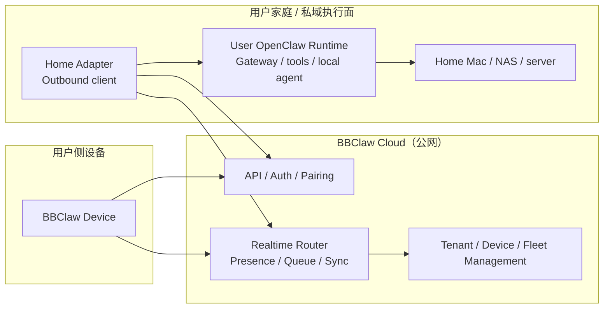
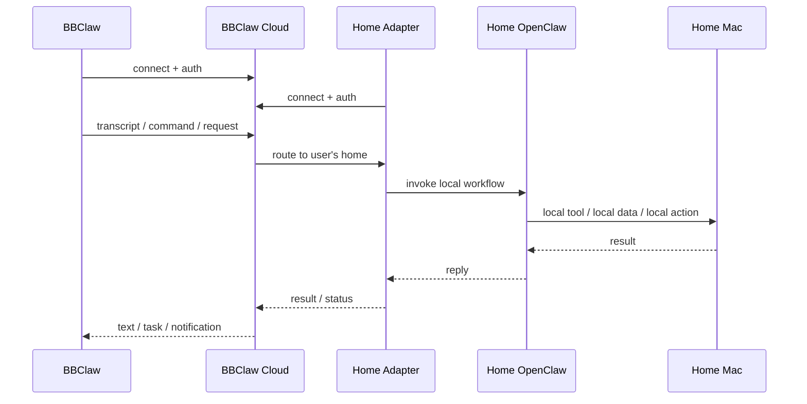
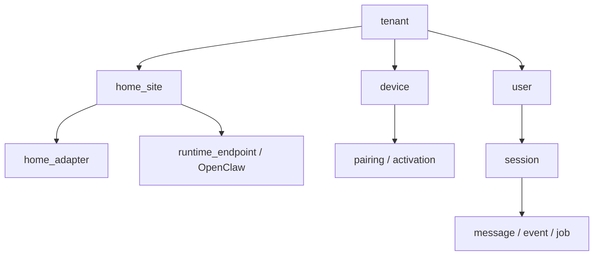
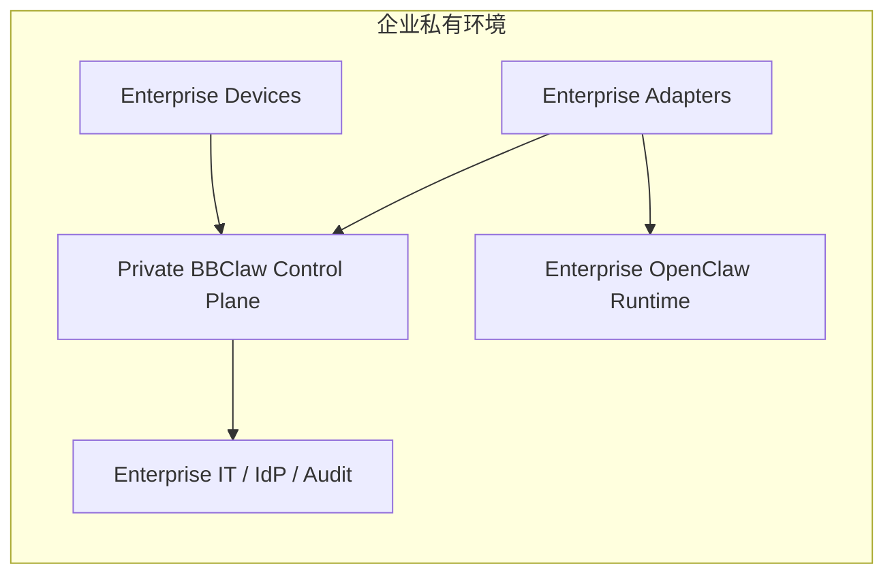

# BBClaw Cloud SaaS 平台架构（Draft）

## 文档目的

本文档用于沉淀 BBClaw 从“当前已跑通的本地链路”向“可产品化、可路演、可多租户、可私有化”的平台架构演进方向。

它描述的是**下一阶段平台方案**，不是当前已经全部落地的运行形态。

当前已跑通实现请参考：

- `docs/architecture.md`
- `docs/protocol_specs.md`
- `src/README.md`

首个可外带版本的最小架构图请参考：

- `docs/cloud_v1_architecture.md`

## 1. 一句话产品定义

BBClaw Cloud 是一个面向硬件语音终端的云控制面平台。

它负责：

- 设备接入
- 身份认证与 pairing
- 在线状态与消息路由
- 离线队列与同步
- 多设备管理
- 用户私有 OpenClaw 运行面的远程打通

它**不应该**默认承载所有用户的本地执行逻辑。

更合理的边界是：

- 云端负责 `control plane`
- 用户自己的 `Home Adapter + OpenClaw` 负责 `execution plane`

## 2. 平台目标

这套平台架构应同时支持三种业务模式：

1. 个人用户
- 用户购买 BBClaw 设备
- 用户在自己家中部署 `Home Adapter`
- `Home Adapter` 对接用户自己的 OpenClaw / 家庭 Mac

2. 多租户 SaaS
- 多个用户/团队共享同一套公网控制面
- 每个租户拥有独立设备、家庭节点、消息与配置空间

3. 企业私有化
- 企业部署独立的 BBClaw 控制面
- 设备、数据、日志、身份体系全部隔离
- 可对接企业内部 OpenClaw、模型、工具、知识库

## 3. 核心边界

### 3.1 云端不是普通 node

公网服务一旦承担以下职责：

- 路由
- pairing
- 账号体系
- 多租户隔离
- 设备注册
- 消息缓存
- 离线同步

它就不应再被定义为“node”。

更准确的定义应是：

- `BBClaw Cloud`
- `control plane`
- `relay / gateway`

### 3.2 用户本地执行面继续保留

云端不直接替代用户的本地 OpenClaw。

本地执行面继续负责：

- 家庭 Mac 的本地能力
- 用户私有模型与工具
- 本地文件、浏览器、自动化、摄像头等能力
- 用户私有数据与上下文

## 4. 目标平台架构

## 5. 关键角色

### 5.1 BBClaw Device

职责：

- 用户语音输入
- 本地显示与交互
- 设备状态上报
- 接收任务、回复与通知

不承担：

- 用户家庭内网暴露
- NAT 穿透中心逻辑
- 复杂租户路由

### 5.2 BBClaw Cloud

职责：

- 账号与租户管理
- 设备注册与激活
- pairing 与设备授权
- 实时消息路由
- 离线缓存
- 设备列表、在线状态、运维后台

不承担：

- 默认直接执行用户的本地命令
- 默认托管用户全部 OpenClaw 数据与工作流

### 5.3 Home Adapter

职责：

- 代表用户家庭网络主动连接云端
- 暴露“这个家庭 / 这台 Mac 可提供什么能力”
- 接收云端下发请求
- 将请求转给本地 OpenClaw 或本地服务
- 将结果、事件、状态回传云端

### 5.4 User OpenClaw Runtime

职责：

- 本地 agent/runtime
- 本地工具调用
- 本地设备能力
- 本地数据与自动化流程

## 6. 典型远程链路

### 6.1 用户在外面，通过 BBClaw 访问家里的 Mac

### 6.2 外网消息同步的产品价值

这样做以后，BBClaw 不只是“家里内网里的一个语音硬件”，而是：

- 可在外出场景下访问家庭执行面
- 可作为随身终端访问用户自己的 OpenClaw
- 可变成真正的“云连接硬件产品”

## 7. 多租户模型

建议从第一版就按多租户设计核心对象：

- `tenant`
- `user`
- `device`
- `device_activation`
- `home_site`
- `home_adapter`
- `runtime_endpoint`
- `session`
- `message`
- `job`
- `event`
- `ack`

### 7.1 关系建议

### 7.2 为什么必须从第一版就做 tenant

如果第一版只按单用户写死，后面会很难补：

- 设备归属
- 用户邀请
- 家庭共享
- 团队空间
- 企业隔离
- 专属实例

因此建议所有核心表从一开始就保留：

- `tenant_id`
- `site_id`
- `device_id`
- `actor_id`

## 8. 商业形态

### 8.1 公有云 SaaS

适合：

- 极客用户
- 个人开发者
- 小团队

交付内容：

- 设备
- 云端账号
- 设备管理后台
- 家庭节点接入
- 远程访问能力

### 8.2 Dedicated

适合：

- 较大团队
- 付费客户
- 对隔离和 SLA 有要求的客户

特点：

- 专属实例
- 专属数据库/缓存
- 独立域名与访问控制

### 8.3 Private / On-Prem

适合：

- 企业
- 政企
- 强隔离客户

特点：

- 控制面私有部署
- 独立身份认证
- 独立日志与审计
- 独立设备注册池
- 完全不经过公有云

## 9. 私有化架构

## 10. 平台能力拆分建议

### 10.1 云端优先做的能力

- 设备激活与注册
- 租户/用户管理
- pairing / 绑定关系
- 在线状态
- 双端消息路由
- 离线消息缓存
- 基础后台

### 10.2 本地优先保留的能力

- 本地模型与 agent 执行
- 本地工具调用
- 家庭 Mac / NAS / 局域网设备操作
- 本地文件与隐私数据访问

### 10.3 暂时不要在第一版做太重的能力

- 云端直接接管全部 AI runtime
- 云端直接托管所有企业本地执行逻辑
- 复杂实时双向音频编排
- 过重的多媒体流转协议

## 11. 与当前工程实现的关系

当前已经跑通的是：

- `Firmware -> adapter -> OpenClaw`

平台方案是下一阶段演进：

- `Device -> Cloud`
- `Home Adapter -> Cloud`
- `Home Adapter -> User OpenClaw`

因此平台演进不应该直接推翻当前实现，而应分阶段：

### 阶段 A

- 保持当前本地链路可用
- 持续稳定 adapter / transcript / display bridge

### 阶段 B

- 设计并实现云控制面
- 先打通 `Home Adapter -> Cloud`
- 再实现 `Device -> Cloud`

### 阶段 C

- 打通用户账户、设备激活、家庭节点绑定
- 形成可销售的设备接入流程

### 阶段 D

- 推出多租户公有云版本
- 预留专属实例与私有化部署能力

## 12. 路演叙事建议

对外路演时，可以把产品表达为：

### 12.1 用户价值

- 用户买到的是一个可随身携带的 AI 终端
- 它可以安全连接用户自己的家庭智能执行面
- 它不要求用户把全部私有数据交给公有云

### 12.2 平台价值

- 设备不是孤立硬件，而是接入一个统一控制面
- 平台支持多设备、多地点、多用户、多租户
- 同时兼容极客用户、团队用户和企业客户

### 12.3 商业价值

- 硬件销售
- SaaS 订阅
- 专属实例
- 企业私有化交付

## 13. 当前结论

这套 SaaS 方向成立，而且具备三条同时可走通的路线：

1. 个人用户买设备后，接入自己的 OpenClaw
2. 平台发展为多租户 SaaS
3. 企业购买后做纯隔离私有化部署

前提是：

- 从第一版就把云端定义为 `control plane`
- 不把云端误定义成普通 node
- 不把用户本地执行面和云端控制面耦死
