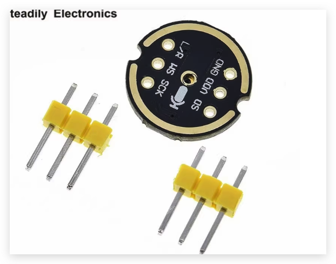

# BBClaw 固件硬件选型与资料缺口（ESP32-S3）

更新时间：2026-03-20

## 1. 推荐选型（先跑通、再优化）

1. 主控：`ESP32-S3R8N8` 开发板（你当前图里的板卡）
2. 屏幕：`1.47" ST7789V3 172x320 SPI` 模组
3. 音频（第一阶段，优先可用）：`INMP441 + MAX98357A`（纯 I2S 数字链路）
4. 音频（第二阶段，可替换）：`ES8311 + NS4150B` codec 方案
5. 触觉反馈（交互增强）：振动马达模块（短脉冲提示）

推荐原因：
- 第一阶段方案驱动路径最短，ESP-IDF 示例和社区资料最完整，能最快闭环 PTT 对讲 + BB 消息显示。
- 第二阶段再切到 ES8311 方案时，可复用 I2S 总线与大部分上层逻辑。
- 增加振动反馈后，可在静音场景提供“开始录音 / 收到任务 / 错误”触觉提示，降低对屏幕和扬声器的依赖。

## 2. 在线依据（已核对）

### 2.1 ESP32-S3

- Espressif ESP32-S3 SoC 页面：双核 LX7（最高 240MHz）、Wi-Fi + BLE、GPIO/I2S/I2C 等外设概览  
  https://www.espressif.com/en/products/socs/esp32-s3
- ESP32-S3 数据手册（官方 PDF）  
  https://www.espressif.com/sites/default/files/documentation/esp32-s3_datasheet_en.pdf
- ESP-IDF ESP32-S3 I2S 文档（v5.5 stable）  
  https://docs.espressif.com/projects/esp-idf/en/stable/esp32s3/api-reference/peripherals/i2s.html

### 2.2 屏幕（1.47" ST7789）

- Waveshare 1.47inch LCD Wiki（172x320、SPI、控制芯片 ST7789V3）  
  https://www.waveshare.com/wiki/1.47inch_LCD_Module
- Waveshare 产品页（4-wire SPI / ST7789V3 / 分辨率参数）  
  https://www.waveshare.com/1.47inch-LCD-Module.htm
- 模组数据手册（Waveshare 文件）  
  https://files.waveshare.com/upload/9/99/1.47inch_LCD_Datasheet.pdf

### 2.3 麦克风（INMP441）

- TDK InvenSense INMP441 产品页（I2S、24-bit、SNR、功耗等）  
  https://invensense.tdk.com/products/digital/inmp441/
- INMP441 数据手册（PDF）  
  https://invensense.tdk.com/wp-content/uploads/2015/02/INMP441.pdf

注意：官方页面标注该器件为 NR/ND（不推荐新设计）。如果你追求长期供货稳定性，需要准备候选替代。

你补充的模块图：`firmware/docs/INMP441.png`

引脚小注释（按模块丝印）：
- `VDD`：电源输入（接开发板 `3V3`）
- `GND`：地
- `SCK`：I2S Bit Clock（接 `BCLK`）
- `WS`：I2S Word Select / LRCK（接 `WS`）
- `SD`：I2S 数据输出（麦克风到 ESP，接 `DIN`）
- `L/R`：左右声道选择（单麦默认固定一侧；保持与软件采集配置一致）

与当前固件默认 pin map 对应：
- `SCK -> GPIO16`
- `WS -> GPIO15`
- `SD -> GPIO18`

### 2.4 功放（MAX98357A）

- Analog Devices MAX98357A 页面（I2S/PCM 输入 D 类功放）  
  https://www.analog.com/en/products/max98357a.html
- MAX98357A/MAX98357B 官方数据手册（PDF）  
  https://www.analog.com/media/en/technical-documentation/data-sheets/max98357a-max98357b.pdf

### 2.5 ES8311 + NS4150B（后续可切换方案）

- Espressif ADF 板卡文档（ESP32-S3-Korvo-2）明确使用 `ES8311 + NS4150` 组合  
  https://docs.espressif.com/projects/esp-adf/en/latest/design-guide/dev-boards/user-guide-esp32-s3-korvo-2.html
- ES8311 资料入口（Everest Semi 官方站）  
  https://www.everest-semi.com/en_products.php
- ES8311 PB 文档（官方站公开链接）  
  https://www.everest-semi.com/pdf/ES8311%20PB.pdf

### 2.6 你提供的立创开发板资料（本地）

资料目录：`/Volumes/1TB/单片机资料/立创·ESP32S3R8N8开发板资料-240926`

关键文件（已可直接用于本项目）：
- 开发板原理图：`第02章.【立创·ESP32S3R8N8】开源硬件/SCH_立创ESP32S3R8N8开发板原理图.pdf`
- 引脚分配图：`第02章.【立创·ESP32S3R8N8】开源硬件/【立创·ESP32S3R8N8开发板】引脚分配图.PNG`
- 板卡尺寸/资源图：`第02章.【立创·ESP32S3R8N8】开源硬件/开发板资源与尺寸标注图.jpg`
- ESP-IDF 在线文档：`第04章.../ESP-IDF/readme.txt` 内飞书链接

从引脚图可确认的约束：
- `GPIO45/GPIO46` 不要加上拉，否则主控可能异常。
- 开启 Wi-Fi/BLE 时，`ADC2` 不能用于 ADC 采样功能（作为普通数字 IO 仍可用）。
- 板载用户 LED 在 `GPIO48`（可用于状态指示）。

### 2.7 你给的淘宝链接（id=940967898928）

- 链接：`https://item.taobao.com/item.htm?id=940967898928`
- 直接访问状态：需要淘宝登录，无法在匿名态读取完整商品详情。
- 可交叉确认来源：你本地资料中 `第04章.../ESP-IDF/readme.txt` 指向的教程文本里，明确把该商品 ID 标注为 `ES8311+NS4150B CODEC` 音频模块购买地址。

结论：
- 这条链接可先按“`ES8311+NS4150B codec 模块`”处理，和你当前掌握的 ES8311+NS4150B 模块资料方向一致。
- 但要进入可生产的硬件冻结，仍需商品详情里的**精确引脚定义/供电说明/板级版本号**截图做最终确认。

### 2.8 你补充的实物图：ES8311+NS4150B

图片：`firmware/docs/ES8311+NS4150B.png`

从图中可确认的 10Pin 引脚定义（自左到右）：
- `SDA`, `SCL`, `MCK`, `BCK`, `DI`, `WS`, `DO`, `3V3`, `VCC`, `GND`

图上还可确认：
- 板载 `ES8311` codec
- 板载 `NS4150B` 功放
- 板上有 `MIC`（数字麦克风）位置和 `SPK` 扬声器座

### 2.9 你补充的实物图：振动马达模块

图片：`firmware/docs/motor.png`

建议用途（固件交互增强）：
- `PTT` 按下成功：短震一次（确认进入录音）
- 下行任务到达：双脉冲
- 上传/识别失败：长震一次

实现建议：
- GPIO 通过 NPN/MOSFET 驱动马达，不要直接由 ESP32-S3 IO 口供电。
- 预留 PWM 或定时脉冲控制，便于后续按事件类型区分触感模式。

## 3. 当前结论（对你这个项目）

- 先用 `ESP32-S3R8N8 + ST7789 + INMP441 + MAX98357A` 完成固件第一版。
- 在第一版稳定后，再评估切换到 `ES8311 + NS4150B` 以获得更完整 codec 控制能力。
- `FY-SP002U` 当前缺少稳定、可验证的公开协议/驱动资料，不建议作为主线路线。

## 4. 还缺什么（请你补充）

以下是我在线检索后仍无法可靠确认、需要你补的内容：

1. 你最终采购的**具体模块链接/BOM**（避免同名不同板）
2. `FY-SP002U` 的原理图、通信接口定义、初始化命令（如果你坚持用它）
3. 这条淘宝链接对应商品详情页截图（重点确认：`VCC` 推荐电压、`PA_EN` 是否需要外控）
5. 喇叭规格与供电方案（阻抗/功率/电池或 USB 供电）
6. 音频目标参数（16k/24k、单声道、半双工或全双工）

## 5. 建议 pin map（专门文档）

引脚映射已独立到专门文档统一维护：
- [Pin Map](./pin_map.md)

本文仅保留硬件选型与风险边界，避免与引脚文档重复维护。

## 6. 固件落地建议（下一步）

1. 先冻结 `v0` 硬件组合：`INMP441 + MAX98357A`  
2. 输出 pin map（一页表格）并写进 `firmware/docs`  
3. 按 pin map 完成 `bb_audio/bb_display/bb_ptt` 驱动替换  
4. 打通 `node.register + node.event + node.invoke` 最小链路  

## 7. ES8311 备选映射

ES8311 备选引脚也统一维护在：
- [Pin Map](./pin_map.md)
