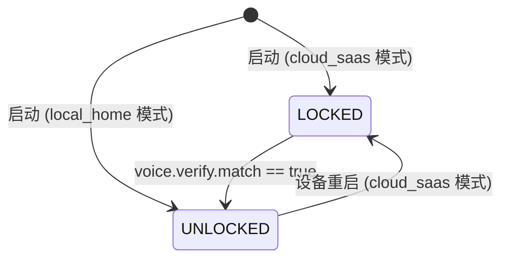
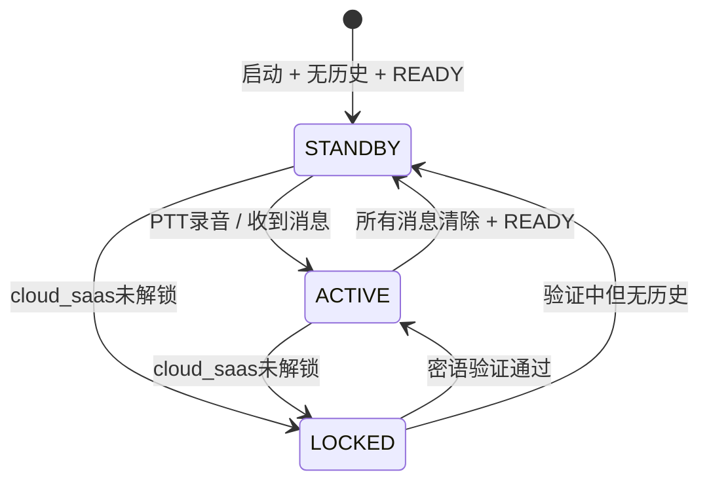

# BBClaw 固件状态机文档

## 概述

BBClaw ESP32 固件采用**多层次独立状态机**架构，不同维度的状态分别管理，通过 `status` 字符串和回调函数进行联动。

```
┌─────────────────────────────────────────────────────────────┐
│                    多层次状态机架构                           │
├─────────────────────────────────────────────────────────────┤
│  App 业务态  │ BBCLAW_STATE_LOCKED / UNLOCKED              │
│  (bb_radio_app.c)                                          │
├─────────────────────────────────────────────────────────────┤
│  UI 显示态  │ UI_VIEW_STANDBY / LOCKED / ACTIVE            │
│  (bb_lvgl_display.c)                                       │
├─────────────────────────────────────────────────────────────┤
│  WiFi 连接态 │ NONE / STA_CONNECTED / AP_PROVISIONING       │
│  (bb_wifi.c)                                               │
├─────────────────────────────────────────────────────────────┤
│  LED 反馈态  │ IDLE / RECORDING / PROCESSING / REPLY ...   │
│  (bb_led.c)                                                │
└─────────────────────────────────────────────────────────────┘
```

---

## 1. App 业务态 (`bb_radio_app_state_t`)

设备的核心业务锁状态，决定 PTT 的行为。

```c
// firmware/include/bb_radio_app.h
typedef enum {
  BBCLAW_STATE_LOCKED = 0,   // 密语锁定态
  BBCLAW_STATE_UNLOCKED = 1, // 正常可使用态
} bb_radio_app_state_t;
```

### 1.1 状态说明

| 状态 | 说明 | 触发条件 |
|------|------|----------|
| `BBCLAW_STATE_LOCKED` | Cloud SaaS 模式下设备锁定，按 PTT 触发密语验证 | 启动时自动设置（仅 cloud_saas 模式） |
| `BBCLAW_STATE_UNLOCKED` | 密语验证通过或 local_home 模式，正常 Q&A 流程 | 密语验证 `match=true`；或 local_home 模式启动 |

### 1.2 状态转换图



### 1.3 PTT 行为差异

| 模式 | 状态 | PTT 按下行为 |
|------|------|-------------|
| `local_home` | `UNLOCKED` | 正常录音 → `voice.stream.start` |
| `cloud_saas` | `LOCKED` | 录音 → `voice.verify` (密语验证) |
| `cloud_saas` | `UNLOCKED` | 正常录音 → `voice.stream.start` |

### 1.4 核心代码位置

| 功能 | 文件位置 |
|------|----------|
| 状态定义 | `firmware/include/bb_radio_app.h:5-8` |
| 状态变量 | `firmware/src/bb_radio_app.c:208` |
| 锁定判断 | `firmware/src/bb_radio_app.c:240-241` |
| 状态切换 | `firmware/src/bb_radio_app.c:248-251` |
| 解锁触发 | `firmware/src/bb_radio_app.c:1417-1419` |
| 启动初始化 | `firmware/src/bb_radio_app.c:2003` |

---

## 2. UI 显示态 (`ui_view_mode_t`)

LVGL 屏幕的显示模式，决定显示哪一套 UI 界面。

```c
// firmware/src/bb_lvgl_display.c:154-158
typedef enum {
  UI_VIEW_STANDBY = 0,  // 时钟 + 品牌图标（待机）
  UI_VIEW_LOCKED,       // 锁图标 + 解锁提示
  UI_VIEW_ACTIVE,       // 状态栏 + 滚动文本区（对话）
} ui_view_mode_t;
```

### 2.1 状态说明

| 状态 | 屏幕内容 | 进入条件 |
|------|----------|----------|
| `UI_VIEW_STANDBY` | 时钟动画、品牌图标、环境信息 | 无对话历史 + status 为 READY/null |
| `UI_VIEW_LOCKED` | 挂锁图标、解锁提示文案 | `radio_app_is_locked()` 为 true + status 是 LOCKED/READY/VERIFY* |
| `UI_VIEW_ACTIVE` | 顶部状态栏、中部滚动文本、底部录音波形 | 有对话历史 或 status 非空闲 |

### 2.2 视图解析逻辑

```c
// firmware/src/bb_lvgl_display.c:417-435
static ui_view_mode_t resolve_view_mode(const char* status, int turn_den, int locked) {
  if (should_show_locked_view(locked, status)) return UI_VIEW_LOCKED;
  if (!is_standby_status(status)) return UI_VIEW_ACTIVE;
  if (turn_den > 0) return UI_VIEW_ACTIVE;  // 有对话历史
  return UI_VIEW_STANDBY;
}
```

### 2.3 状态转换图



---

## 3. WiFi 连接态 (`bb_wifi_mode_t`)

设备的 WiFi 连接模式。

```c
// firmware/include/bb_wifi.h:5-9
typedef enum {
  BB_WIFI_MODE_NONE = 0,              // 未连接
  BB_WIFI_MODE_STA_CONNECTED = 1,    // STA 模式已连接
  BB_WIFI_MODE_AP_PROVISIONING = 2,  // AP 配网模式
} bb_wifi_mode_t;
```

### 3.1 状态说明

| 状态 | 说明 | 进入条件 |
|------|------|----------|
| `BB_WIFI_MODE_NONE` | WiFi 未初始化或已断开 | 初始态 或 STA 断开 |
| `BB_WIFI_MODE_STA_CONNECTED` | 正常连接已保存的 WiFi | NVS 有凭据 + 连接成功 |
| `BB_WIFI_MODE_AP_PROVISIONING` | 设备作为热点待配网 | STA 连接超时 (`BBCLAW_WIFI_STA_CONNECT_TIMEOUT_MS`) |

### 3.2 AP 配网流程

```
启动 → 检查 NVS WiFi 凭据
  ↓ 有凭据
STA 连接尝试
  ↓ 超时 (默认 10s)
自动切换到 AP 模式
  ↓
SSID: BBClaw-Setup-xxxx
Password: bbclaw1234
Web Portal: http://192.168.4.1/
  ↓ 配置成功
设备重启 → STA 模式
```

### 3.3 核心代码位置

| 功能 | 文件位置 |
|------|----------|
| 状态定义 | `firmware/include/bb_wifi.h:5-9` |
| AP 模式入口 | `firmware/src/bb_wifi.c:818` |
| STA 断开处理 | `firmware/src/bb_wifi.c:835` |
| 配网检测 | `firmware/src/bb_wifi.c:928-929` |

---

## 4. LED 反馈态 (`bb_led_status_t`)

三色 LED 的语义化状态，通过颜色和闪烁模式传达设备状态。

```c
// firmware/include/bb_led.h
typedef enum {
  BB_LED_IDLE = 0,          // 绿色空闲（稳定）
  BB_LED_RECORDING = 1,     // 黄色录制（本地处理中，稳定）
  BB_LED_PROCESSING = 2,    // 黄色处理（闪烁，区分处理方）
  BB_LED_REPLY = 3,         // 绿色回复中（脉冲）
  BB_LED_NOTIFICATION = 4,  // 蓝色通知
  BB_LED_SUCCESS = 5,      // 绿色成功（脉冲）
  BB_LED_ERROR = 6,        // 红色错误
} bb_led_status_t;
```

### 4.1 LED 颜色语义

| 颜色 | 含义 | 场景 |
|------|------|------|
| 绿色 (稳定) | 设备稳定/完成 | IDLE, SUCCESS 脉冲 |
| 绿色 (脉冲) | 处理完成确认 | 1脉冲=本地, 2脉冲=适配器, 3脉冲=云端 |
| 黄色 (稳定) | 本地处理中 | RECORDING |
| 黄色 (闪烁) | 等待/远程处理 | PROCESSING (1闪=本地, 2闪=适配器, 3闪=云端) |
| 红色 | 错误/异常 | ERROR |
| 蓝色 | 通知 | NOTIFICATION |

### 4.2 详细闪烁模式

详见 [`firmware/docs/rgb_led_status.md`](rgb_led_status.md)。

---

## 5. Status 字符串映射

`status` 字符串是业务态与 UI 层的通信协议。

### 5.1 完整映射表

| Status 字符串 | 含义 | UI 图标 | LED 状态 |
|---------------|------|---------|----------|
| `TX` | 录音中/发送中 | 发射图标 | `BB_LED_RECORDING` |
| `RX` | 接收中 | 接收图标 | `BB_LED_PROCESSING` |
| `TRANSCRIBING` | 语音转文字 | 处理图标 | `BB_LED_PROCESSING` |
| `PROCESSING` | 云端处理中 | 处理图标 | `BB_LED_PROCESSING` |
| `RESULT` | 结果返回 | 结果图标 | `BB_LED_REPLY` |
| `SPEAK` | TTS 播报中 | 说话图标 | `BB_LED_REPLY` |
| `TASK` | 任务处理中 | 任务图标 | `BB_LED_PROCESSING` |
| `BUSY` | 忙碌中 | 任务图标 | `BB_LED_PROCESSING` |
| `READY` | 就绪/待机 | 就绪图标 | `BB_LED_IDLE` |
| `LOCKED` | 锁定态 | 锁图标 | `BB_LED_IDLE` |
| `VERIFY` | 密语验证中 | 锁图标 | `BB_LED_RECORDING` |
| `VERIFY TX` | 密语发送中 | 锁图标 | `BB_LED_RECORDING` |
| `VERIFY ERR` | 密语验证失败 | 锁图标 | `BB_LED_ERROR` |
| `BOOT` | 启动中 | 处理图标 | `BB_LED_PROCESSING` |
| `WIFI` | WiFi 状态 | 处理图标 | `BB_LED_PROCESSING` |
| `ADAPTER` | 适配器连接 | 处理图标 | `BB_LED_PROCESSING` |
| `SPK` | 扬声器测试 | 处理图标 | `BB_LED_PROCESSING` |
| `PAIR` | 配对中 | 配对图标 | `BB_LED_PROCESSING` |
| `ERR` | 错误 | 错误图标 | `BB_LED_ERROR` |
| `AUTH` | 认证问题 | 错误图标 | `BB_LED_ERROR` |

### 5.2 关键解析逻辑

```c
// firmware/src/bb_lvgl_display.c:417-426
static int is_standby_status(const char* status) {
  return status == NULL || status[0] == '\0' || strcmp(status, "READY") == 0;
}

static int should_show_locked_view(int locked, const char* status) {
  if (!locked) return 0;
  if (status == NULL || status[0] == '\0') return 1;
  if (strcmp(status, "LOCKED") == 0 || strcmp(status, "READY") == 0) return 1;
  if (strncmp(status, "VERIFY", 6) == 0) return 1;
  return 0;
}
```

---

## 6. 用户场景映射

| 用户场景 | App 态 | UI 态 | WiFi 态 | LED | Status |
|----------|--------|-------|---------|-----|--------|
| 首次开机配网 | UNLOCKED | ACTIVE | AP_PROVISIONING | PROCESSING | WIFI |
| 待机（无活动） | UNLOCKED | STANDBY | STA_CONNECTED | IDLE | READY |
| 按住 PTT 说话 | UNLOCKED | ACTIVE | STA_CONNECTED | RECORDING | TX |
| 云端处理中 | UNLOCKED | ACTIVE | STA_CONNECTED | PROCESSING | PROCESSING |
| TTS 播报回复 | UNLOCKED | ACTIVE | STA_CONNECTED | REPLY | SPEAK |
| cloud_saas 未解锁待机 | LOCKED | LOCKED | STA_CONNECTED | IDLE | LOCKED |
| cloud_saas 按住说密语 | LOCKED | LOCKED | STA_CONNECTED | RECORDING | VERIFY TX |
| 密语验证通过 | UNLOCKED | ACTIVE | STA_CONNECTED | SUCCESS | READY |
| 密语验证失败 | LOCKED | LOCKED | STA_CONNECTED | ERROR | VERIFY ERR |
| WiFi 连接失败 | UNLOCKED | ACTIVE | AP_PROVISIONING | PROCESSING | WIFI |

---

## 7. 核心代码索引

| 模块 | 文件 | 关键函数/变量 |
|------|------|--------------|
| App 态管理 | `firmware/src/bb_radio_app.c` | `s_app_state`, `set_radio_app_state()`, `radio_app_is_locked()`, `passphrase_unlock_enabled()` |
| PTT 状态机 | `firmware/src/bb_radio_app.c` | `ptt_state_task()` (主循环) |
| 密语验证流程 | `firmware/src/bb_radio_app.c` | `voice_verify_capture_*`, `handle_voice_verify_result()` |
| UI 视图解析 | `firmware/src/bb_lvgl_display.c` | `resolve_view_mode()`, `should_show_locked_view()`, `is_standby_status()` |
| UI 视图渲染 | `firmware/src/bb_lvgl_display.c` | `render_view()`, `refresh_display()` |
| WiFi 状态机 | `firmware/src/bb_wifi.c` | `bb_wifi_init_and_connect()`, `bb_wifi_get_mode()`, `bb_wifi_is_provisioning_mode()` |
| LED 控制 | `firmware/src/bb_led.c` | `bb_led_set_status()`, `bb_led_update()` |

---

## 8. 相关文档

- [密语解锁功能](./feat/passphrase-unlock.md) - Cloud SaaS 密语验证详解
- [LED 状态规范](./rgb_led_status.md) - LED 颜色和闪烁模式详解
- [UI 界面规范](./lvgl_landscape_ui_spec.md) - 屏幕布局和组件规范
- [协议规范](../../docs/protocol_specs.md) - `voice.verify` 和 `voice.stream` 协议
